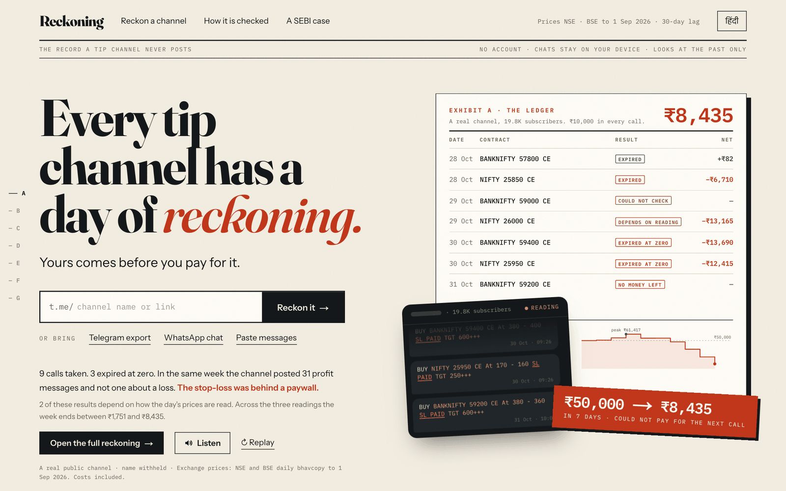
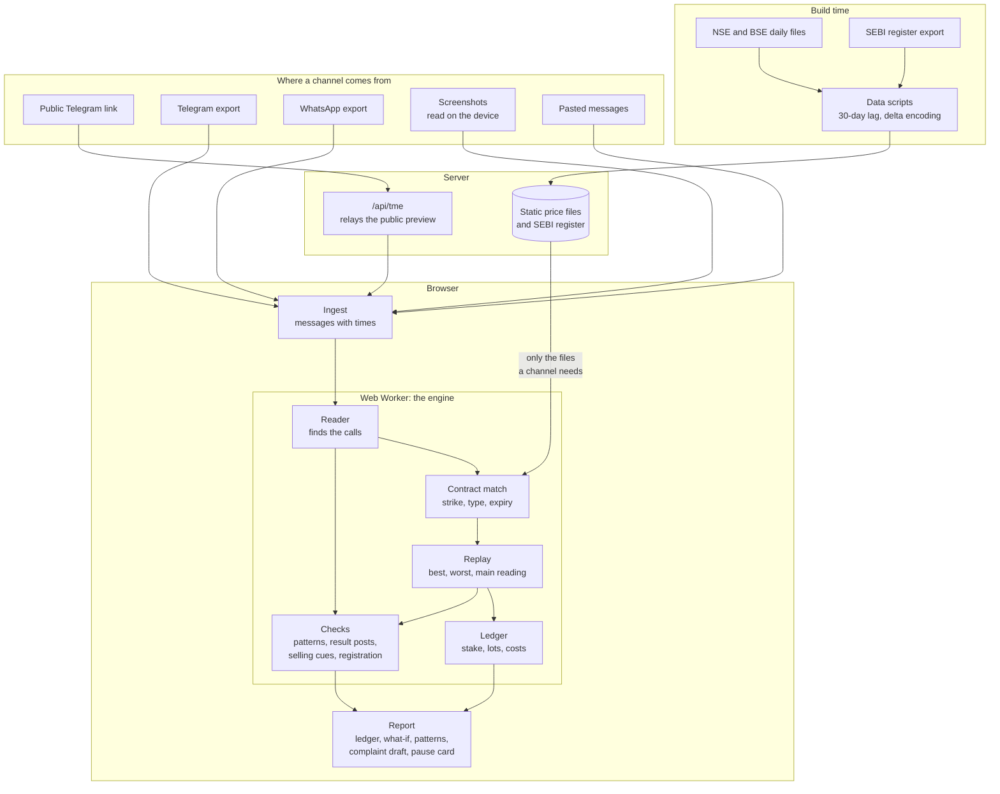

# Reckoning

**Live demo:** [reckoning-sigma.vercel.app](https://reckoning-sigma.vercel.app)

**Every tip channel has a day of reckoning. Yours comes before you pay for it.**

Reckoning reads every call a stock-tip channel has posted, replays each one against the exchange's own prices, and shows the record the channel never posts: which calls reached their target, which expired at zero, and what a follower's account would have been left with.



    

It looks backward only. It gives no advice on any stock or contract, predicts nothing, and sells nothing.

## What it does

1. **Reads a channel five ways**: a public Telegram link, a Telegram export file, a WhatsApp chat export, screenshots of the chat, or pasted messages. Screenshots are read on the device and shown for correction first.
2. **Finds the calls** with a fixed set of rules, so the same message always reads the same way. English, Hindi and Hinglish; options, futures and shares; misspelt names; calls split across messages; reposts.
3. **Replays each call** on the exact contract's daily prices from NSE and BSE: entry at the quoted price if it traded, exit at the first target, the stop-loss, or expiry.
4. **Keeps a ledger**: ₹50,000 to start, ₹10,000 in every call, whole lots, costs taken off. It stops taking calls when the account cannot pay for one.
5. **Reads every doubtful day three ways** (best for the channel, worst, and a main figure) and marks each result that depends on the reading.
6. **Sets the hit rate beside a coin's**: what a directionless price would hit with the same targets and stop-losses.
7. **Checks what the channel said afterwards**: wins announced, losses never mentioned, and result posts quoting a price the contract had not traded at.
8. **Counts what the messages sell**: paid groups, payment ids, stop-losses withheld for payment, guarantees.
9. **Checks SEBI registration** numbers against a dated copy of SEBI's public register.
10. **Looks for patterns** in price and volume around each call: a jump on heavy volume, a jump that falls back, a run-up before the call, SME-platform and thinly traded stocks, options bought on expiry day.
11. **Replays the same calls with your money**: your capital, your stake per call, and how much of it is borrowed.
12. **Sets a 24-hour pause**: your own reason, in your own words, and a clock.
13. **Drafts the report**: an editable complaint, the call list as CSV, and a printable evidence sheet, with the right place to send them.
14. **Reads in eight languages**: English, Hindi, Marathi, Gujarati, Punjabi, Bengali, Tamil and Telugu. Each language is fetched only when it is chosen. The summary can be listened to: a recorded voice on the first page in English and Hindi, the device's own speech voice elsewhere.

Everything runs in the browser. Messages are never uploaded; price files are fetched from the site's own static folder.

## What the numbers say

Figures the site shows, all reproducible with the scripts in this repository:

| | |
|---|---|
| Sample channel (19.8K subscribers, name withheld) | 1,400 messages, 384 calls, 343 replayed |
| Its opening week | ₹50,000 became ₹8,435 after nine calls in seven days (₹1,751 to ₹8,435 across the three readings) |
| Its hit rate | 59% of targets reached; a coin would reach 76% with the same targets and no stop-loss |
| Its messages | 969 about points and profit, 0 about a loss, in a channel where 119 calls lost money |
| Twelve public channels with 30 or more replayed calls | 8 reached their targets less often than the coin; 4 stay below it on the reading kindest to the channel |

## Measured on a known case

The pattern checks were run on the recommendations listed in Annexure A of SEBI's ex-parte interim order WTM/KV/ISD/ISD-SEC-7/32413/2026-27 (22 May 2026), and on ordinary days in the same stocks. 138 of the order's 248 recommendations fall inside the price files.

| Pattern | After the order's recommendations | Ordinary days, same stocks |
|---|---|---|
| Jumped on heavy volume | 30.4% (42 of 138) | 5.0% (233 of 4,620) |
| Jumped, then fell back | 13.0% (18 of 138) | 1.9% (86 of 4,620) |
| Already running before the post | 28.3% (39 of 138) | 5.3% (244 of 4,620) |
| Thinly traded | 5.8% (8 of 138) | 19.0% (879 of 4,620) |

The last row is a check that did not separate the two groups, and the site says so. An interim order records what SEBI found on a first view; it is not a final finding, and no person is named anywhere in this project.

## Architecture



The server does two things: it relays a public channel's preview page, and it serves static files. Reading, replaying and every figure in the report are computed in the browser, so messages from an export, a screenshot or a paste never leave the device.

## Project structure

```
reckoning/
├── src/
│   ├── app/                    pages and the one server route
│   │   ├── page.tsx            landing page
│   │   ├── reckon/             the report for one channel
│   │   ├── method/             how a call is checked
│   │   ├── case/               the pattern checks on a SEBI order
│   │   └── api/tme/            relay for a public channel's preview
│   ├── engine/                 everything that decides a result
│   │   ├── extract.ts          reads calls and result posts out of messages
│   │   ├── symbols.ts          stock and contract names, nicknames, misspellings
│   │   ├── resolve.ts          matches a call to its exact contract
│   │   ├── replay.ts           entry, target, stop-loss and expiry under three readings
│   │   ├── ledger.ts           the account: stake, lots, costs, borrowed money
│   │   ├── detect.ts           price-and-volume patterns, result posts against prices
│   │   ├── promo.ts            what the messages sell
│   │   ├── registration.ts     SEBI registration numbers against the register
│   │   └── reckon.ts           runs all of the above for one channel
│   ├── data/                   compact price-file format and its reader
│   ├── ingest/                 Telegram preview, Telegram export, WhatsApp export, screenshots, pasted text
│   ├── worker/                 runs the engine off the main thread
│   ├── components/
│   │   ├── landing/            the exhibits below the ledger replay
│   │   └── reckon/             report sections and charts
│   ├── lib/                    the text in eight languages, formats, spoken numbers, complaint draft, screenshot reader
│   └── samples/                figures the pages show, written by the scripts
├── scripts/                    data download and build, sample, figures, case, voice
├── tests/                      282 tests, including 184 hand-checked real messages
└── public/
    ├── data/                   price files (663 trading days) and the register copy
    ├── samples/                the sample channel, identifying details removed
    ├── audio/                  the recorded summaries
    └── ocr/                    the screenshot reader and its English language file
```

## How a call is checked

1. A message counts as a call when a stock or contract and at least one price can be read from it. Messages that look like calls but cannot be read are counted and shown.
2. An option is matched to its exact strike, type and expiry. With no expiry in the message, the nearest expiry in which the quoted price actually traded is used.
3. The call is entered at the quoted price only if that price traded that day.
4. It ends at the first target or the stop-loss. With neither, an option is held to expiry and settled against the index or stock.
5. A daily file cannot say whether a price printed before or after a message, so every call is replayed three ways. The main figure counts a doubtful win only when the channel announced it at the time.

The full rules are on the site's "How it is checked" page and in `src/engine/`.

## What it cannot do

- It cannot see inside a trading day. The exchanges publish one open, high, low and close per day; results that depend on the order of prices within the day are marked, and the account is given as a range.
- It does not read pictures a channel posts in place of text. Screenshots a person brings are read as English text only; the day they were posted has to be confirmed, and a misread figure corrected by hand.
- It has no prices for commodities, currencies, crypto or foreign markets, and says so for each such call.
- It cannot read a channel whose public preview is switched off, except from an export file.
- Stock option contracts are not restated across a split or bonus.
- It cannot tell whether a follower could actually have bought at the quoted price, or how late they saw the message.
- The complaint draft and the call list are written in English only.
- It says nothing about what any stock or contract will do next, and never will.

## Run it

```bash
npm install
npm run dev        # http://localhost:3000
npm test           # 282 tests
npm run build
```

The price files, the register copy, the sample and the recorded voice are already in `public/`. To generate them again:

```bash
npm run data:fetch                                   # NSE and BSE daily files into data-raw/
NODE_OPTIONS=--max-old-space-size=12288 npm run data:build   # compact price files into public/data/
npm run data:register                                # SEBI's register of analysts and advisers
npm run reckon -- <channel handle>                   # reckon one public channel on the command line
npm run samples && npm run landing                   # the sample channel and the landing page's figures
npm run case                                         # the pattern checks on the SEBI order
npm run voice                                        # the recorded summaries (needs Python, kokoro, espeak-ng, ffmpeg)
```

## Data

- **Prices**: NSE cash and F&O daily bhavcopy, and BSE derivatives bhavcopy for SENSEX and BANKEX. 3,854 stocks and 7,665 option expiries, stored as delta-encoded files of at most 150 KB each so a phone fetches only what a channel needs.
- **30-day lag**: price data stops 30 days before the day it was built, as SEBI's circular of 8 May 2026 requires of tools that use market prices for investor education. Calls newer than that show as "too recent".
- **Splits and bonuses**: found from the price gap on the day they take effect.
- **Register**: SEBI's public list of Research Analysts and Investment Advisers, copied on the date shown on the site.
- **Sample channel**: a real public channel. Its name, links, handles, phone numbers and payment ids are removed before anything is stored.

## Third-party software

Next.js, React, Tailwind CSS, GSAP (scroll motion), fflate (decompression), Tesseract.js (reads the text in screenshots, in the browser; Apache-2.0), Vitest and Playwright (tests and checks). Fonts: Fraunces, Instrument Sans, IBM Plex Mono, Rozha One, Anek Devanagari, all under the SIL Open Font License. The recorded summaries are spoken by Kokoro-82M (Apache-2.0), run locally once; the site calls no speech or language service. No language model is used anywhere: the reader is a fixed set of rules.

## Licence

MIT. See [LICENSE](LICENSE).
